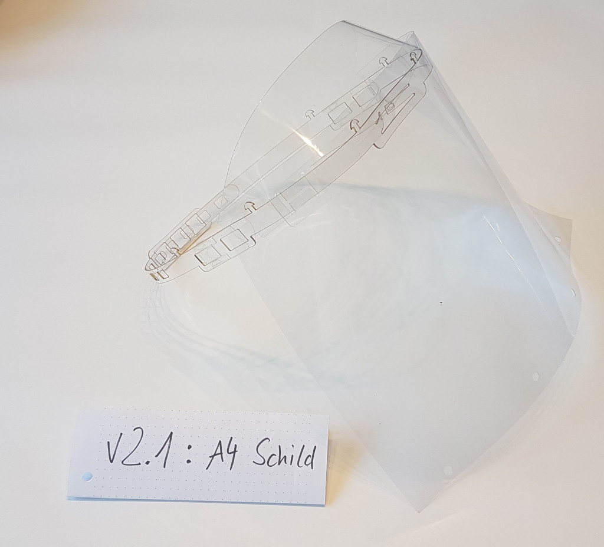
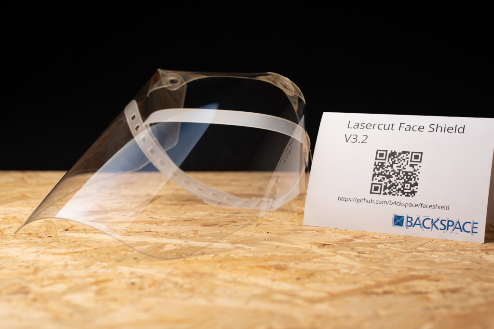
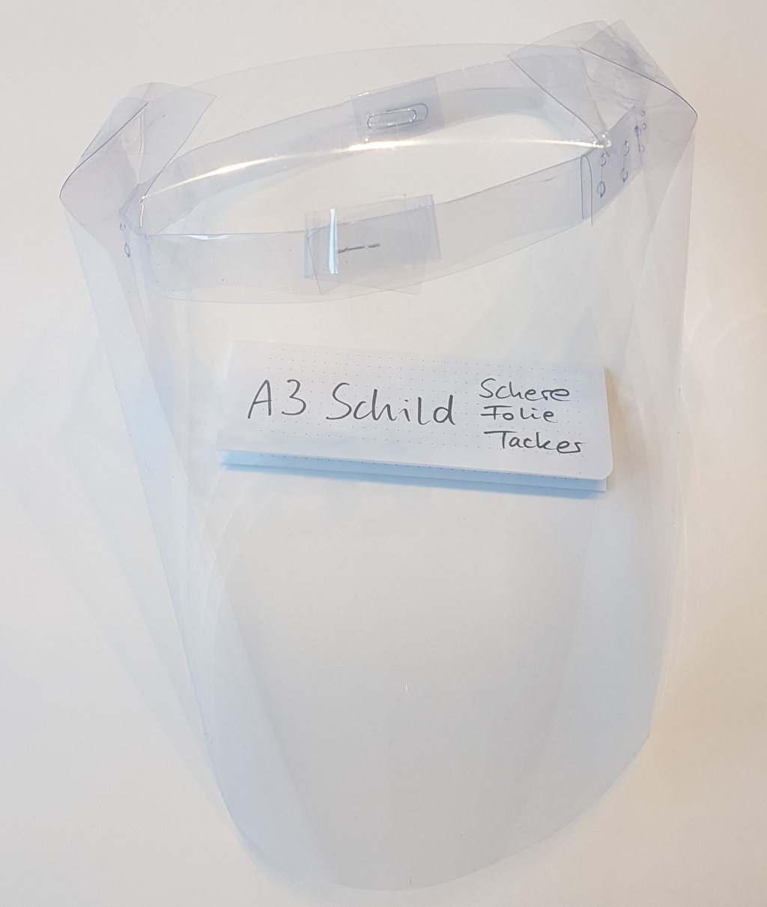

# Lasercut Face Shield

Due to the Covid-19 outbreak, there is an increased need for face protection for health care professionals and many others. There are multiple projects that are trying to offer makeshift solutions. These are ours.

Our face shields are laser cut which allows producing lots of shields quickly. What makes our v1 and v2 shields different is that we are not cutting the actual shield but use off the shelf A4 or A3 transparency sheets. That way the laser cut pieces can be reused multiple times while only replacing the transparency shield. This is not a new idea but other projects offering this feature are all 3D printed which limits the output.

The sheet is attached with standard pattern holes that can be created with a normal 80mm, Euro pattern hole puncher. Support for 888 patterns or full 4 hole punchers are of benefit.

## Version 1
Still primitive, uses hollow rivets for construction

[Details](v1/)

## Version 2
More sophisticated. Comes with a shield for the fore head. Is more flat at the front. No needs for fasteners.

[Details](v2/)

## Version 3
A full shield cut from thicker material (0.7mm PET and 0.8mm PP).

[Details](v3/)

## Shield from Office Supplies
A shield made only out of an A3 sheets with normal office supplies. No need for a laser cutter or other exotic tools.

[Build instructions](A3-Sheet-only/manual.md)

## Status

All variants work quite well, but they depend a lot on the materials used. The different plastics cut and behave quite differently. Polycarbonate ist really tough and cuts well but produces a huge mess and clogs up the filters really fast. The 0.69mm PET has good optical quality but tends to be brittle and a lot of fancy features had to be abandoned for v3 as the material would just break too easily. We are currently using 0.8mm Polypropylene as head straps as it is soft and does not break. This works fine for V3 but might not be stiff enough for an unsupported arc holding an heavy shield in front of the face.

The lesson learned here is that each new material basically requires some new engineering effort.
