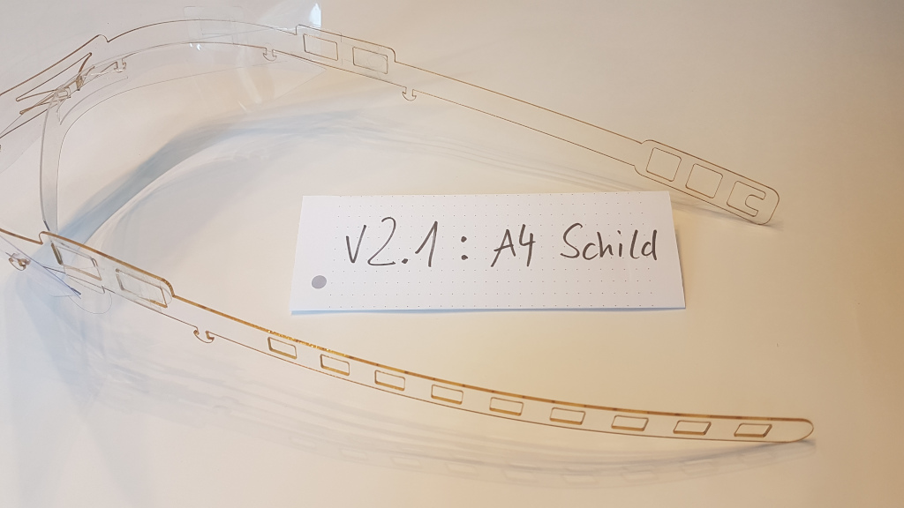

# Face Shield Version 2

This also a holder for a transparent sheet. Both A4 and A3 sizes are supported. The two main parts need to be cut from a stiff material. 1 to 1.5mm thickness should work for plastics like Polycarbonate (PC), Polystylol (PS) or PETG. The fore head shield needs to be more elstic. We used .5mm PETG but this can surely be made from even thinner material.

# Assembly

The short strap needs to be put through the inner rectangular holes until the wider part is on the outside. Then turn the strap upright so it cannot get out again. The thinner ends are then put to the next hole to lock the strap in place.

Connect the flaps at the front by twisting them an put the inner ends through the holes at the outside strap.

If you want the front shield to be less round at the bottom you can put two of the small pieces with the mushrooms at the ends into holes on both sides. You need an 888 holes patter at the bottom of the sheet for this (4 holes each 80mm appart). But we found that to not be necessary.