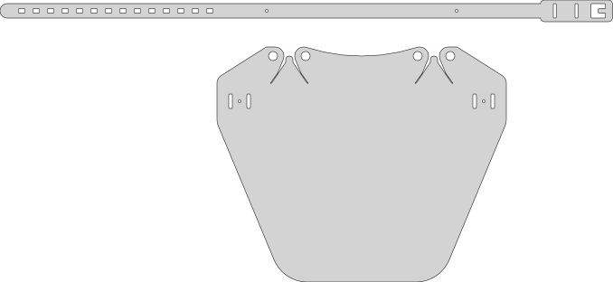
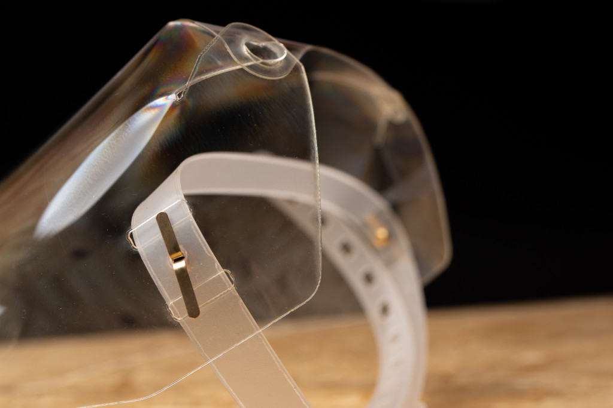

# Laser Cut Face Shield V3.2

This variant is optimized for the material we had at hand: 0.69mm PET. It is still unclear what is the exact cause but our material tends to break in a brittle way - sometimes. This forces this model to be more primitive and to avoid more clever solutions.

The shield consists of two laser cut parts: The shield itself, made from 0.69mm PET that gets folded inwards at the top and the head strap made from 0.8mm PP which is much softer.

They are connected with two split pin paper fasteners. While they look very unfomfortable they actually barely touch the head of the wearer.

What sets this shield appart from others:

The shield is bend inwards at the top. This reduces the gap between the shield and the head. It also stiffens the shield and keeps it more flat at the front. This makes it easier to see through and reduces reflections and glares.

No elastic band used. This makes it easier to desinfect. It also allows putting it on with only one hand. So it may be more conviniet in situations where the shield needs to be put on and off very often or very quickly. Size of the head strap can be adjusted easily. The current material we use is on the soft side for this mechanism. It works even better with stiffer materials - either thicker PP or other plastics like PC or PS.

There are multiple intermediate versions that use more clever ways of construction and don't need additional hardware. We will publish them here soon.
